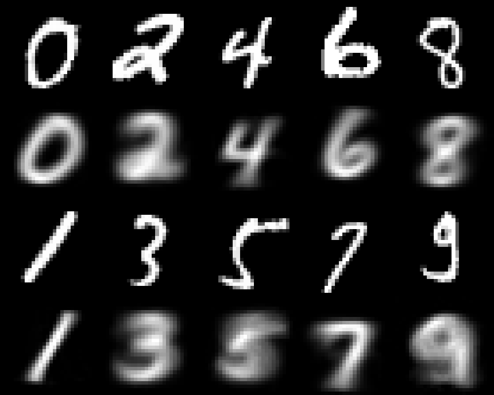

# Capsule Net in MxNetR

This is a simple example for implementing the Capsule Net by MxNetR. However, I have reduce the number of filter of initial convolutional layer (256 -> 64) and number of capsule channel (32 -> 8). The number of deconvolution filter are also reduced (512, 1024 -> 64, 128). If you want to get the original Capsule Net reporting in paper, please revise the function parameters. This simplified Capsule Net only includes 1,434,688 parameters and achieve 98.75% accuracy in testing set. The model architecture information is stored in [4. Model architecture.R](https://github.com/xup6fup/MxnetR-CapsuleNet/blob/master/code/5.%20Training%20process.R).

If you want to repeat my work, please use [5. Training process.R](https://github.com/xup6fup/MxnetR-CapsuleNet/blob/master/code/4.%20Model%20architecture.R) for training.

Following figure is a visualization example for understanding Capsule Net, and it can be repeated by [7. Predict and Reconstruction.R](https://github.com/xup6fup/MxnetR-CapsuleNet/blob/master/code/7.%20Predict%20and%20Reconstruction.R). The top images are real digit images, and the bottom images are imagined pictures by Capsule Net.

