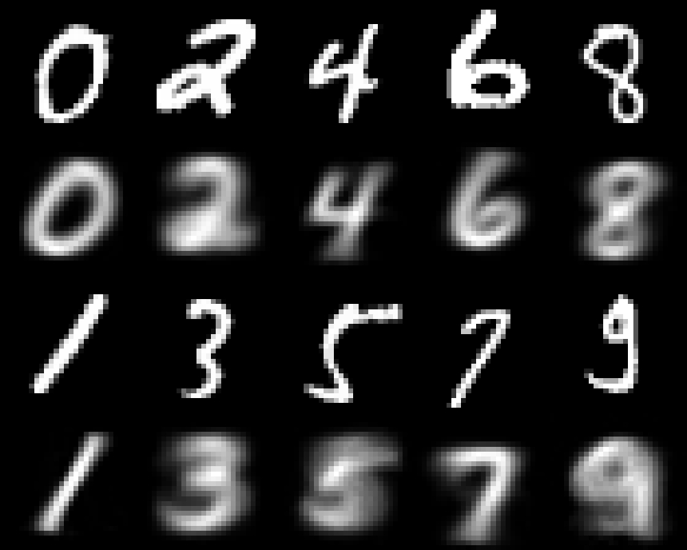

# Capsule Net in MxNetR

This is a simple example for implementing the Capsule Net by MxNetR. The original paper is titled ["Dynamic Routing Between Capsules"](https://arxiv.org/abs/1710.09829). However, I have reduce the number of filter of initial convolutional layer (256 -> 128) and number of capsule channel (32 -> 16). The number of deconvolution filter are also reduced (512, 1024 -> 128, 256). If you want to get the original Capsule Net reporting in paper, please revise the function parameters. This simplified Capsule Net only includes 3,695,488 parameters and achieve 98.96% accuracy in testing set. The model architecture information is stored in [4. Model architecture.R](https://github.com/xup6fup/MxnetR-CapsuleNet/blob/master/code/5.%20Training%20process.R).

The MNIST dataset was converted to two csv data in the "data" folder. The first column represents the labels (0 to 9), and the other 784 columns represent the pixel value in a 28*28 images. If you want to repeat my work, please use [5. Training process.R](https://github.com/xup6fup/MxnetR-CapsuleNet/blob/master/code/4.%20Model%20architecture.R) for training. The training speed is about 200 samples/sec in a server with single NVIDIA tesla P100 (batch size = 20).

Following figure is a visualization example for understanding Capsule Net, and it can be repeated by [7. Predict and Reconstruction.R](https://github.com/xup6fup/MxnetR-CapsuleNet/blob/master/code/7.%20Predict%20and%20Reconstruction.R). The top images are real digit images, and the bottom images are imagined pictures by Capsule Net.

